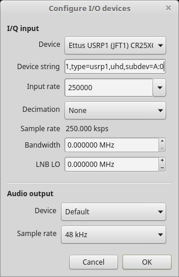
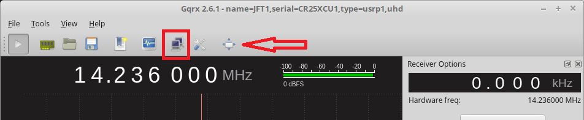
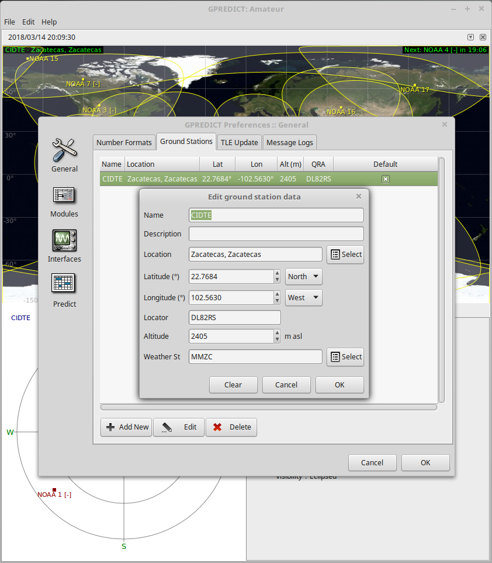
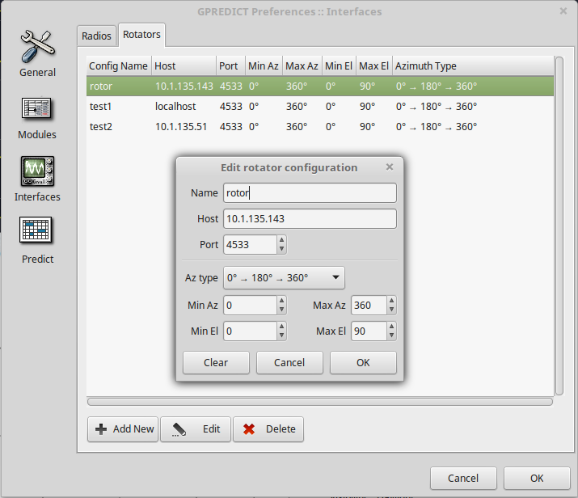
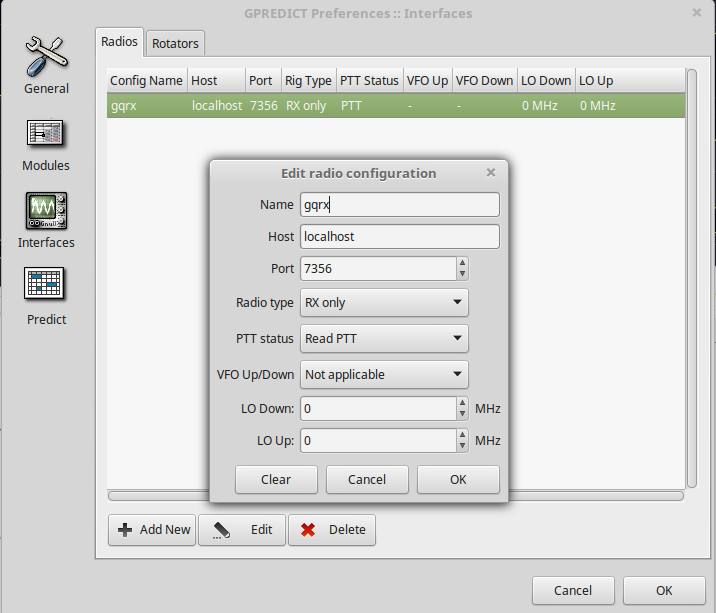
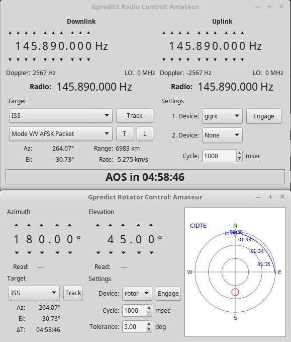

# Estación Terrena

Este repositorio incluye los archivos de control y electrónica para el rotor de corriente directa desarrollado en [CIDTE](http://cidte.uaz.edu.mx/web/).

## Código de control

El archivo [control_CIDTE](control_CIDTE) incluye el codigo de Arduino para motores de corriente directa.

Para comenzar con el Arduino agregue las librerías del proyecto y conecte los componentes electrónicos, antes de ejecutar el código de control.

Cargue el código en la placa Arduino UNO, esta no ejecuta ninguna acción hasta conectarse a la librería Hamlib. 

## Configuración de la computadora del usuario

La computadora del usuario, ejecuta el software de la estación terrena, para rastreo satelital Gpredict y Gqrx como receptor.

Instale el software Gpredict y la librería completa de Hamlib con los comandos:
```bash
    sudo apt-get install ham-lib
    sudo apt-get install hamlib-dev libasound-dev libv4l-dev
    sudo apt-get install libhamlib-utils
    sudo apt-get install gpredict
```
Para instalar Gqrx ejecute los siguientes comandos, para información más detallada visite [Gqrx SDR](http://gqrx.dk/download/install-ubuntu):
```bash
    sudo apt-get purge --auto-remove gqrx
    sudo apt-get purge --auto-remove gqrx-sdr
    sudo apt-get purge --auto-remove libgnuradio*
    sudo add-apt-repository -y ppa:bladerf/bladerf
    sudo add-apt-repository -y ppa:myriadrf/drivers
    sudo add-apt-repository -y ppa:myriadrf/gnuradio
    sudo add-apt-repository -y ppa:gqrx/gqrx-sdr
    sudo apt-get update
    sudo apt-get install gqrx-sdr
    sudo apt-get install libvolk1-bin
    volk_profile
```

Debe tener una conexión remota con las Raspberry Pi (RPi) de la estación terrena vía SSH, por ejemplo:
```bash
      ssh pi@10.1.135.143
```
Si no conoce la dirección IP de la RPi, puede buscarla en la red del CIDTE con el comando:
```bash
      nmap -p22 10.1.135.0/24
```

## Configuración de Raspberry Pi

Establezca primero la conexión SSH con la RPi desde la computadora del usuario.

Debe instalar la librería completa de Hamlib para Gpredict con los siguientes comandos:
```bash
    sudo apt-get install ham-lib
    sudo apt-get install hamlib-dev libasound-dev libv4l-dev
    sudo apt-get install libhamlib-utils
```

Conecte el Arduino UNO, con el código de control cargado, a un puerto USB.

Para conectar el rotor manualmente a Hamlib ejecute:
```bash
      rotctl -m 202 -r /dev/ttyACM0 -s 19200 -C timeout=500 -vvv
```
Para leer los comandos de la libreria teclee: ?

Para conectar el rotor a Gpredict ejecute:
```bash
      rotctld -m 202 -r /dev/ttyACM0 -s 19200 -C timeout=500 -vvv
```

## Configuración de Gqrx

El radio receptor de la estación terrena es el USRP1 de Ettus, utilizando la tarjeta WBX-FE-Simple.
Conecte el USRP1 a un puerto USB de la computadora del usuario, para configurar el dispositivo ejecute los comandos:
```bash
      sudo apt install libuhd-dev
      sudo apt install uhd-host
      sudo uhd_imagenes_downloader
      sudo "/usr/lib/uhd/utils/uhd_images_downloader.py"
```
Para rectificar que la computadora reconoce el dispositivo, ejecute:
```bash
      sudo uhd_find_devices
```
Ejecute Gqrx y agregue la descripción "subdeb=A:0" en la configuración inicial.  


Para conectar el USRP1 en Gqrx a Gpredict, utilice la opción "Control Remoto Vía TCP".


## Configuración de Gpredict

Para las configuraciones de Gpredict, abra la ventana de preferencias: "Editar" >> "Preferencias"

Primero configure la posición de observación, en la opción "Estación Terrena" agregue una nueva configuración con las coordenadas geográficas de la estación terrena.


Para configurar el rotor de la estación terrena, en la opción "Interfaces" >> "Rotores" agregue una configuración con la dirección IP de la RPi. Si no tiene una dirección IP fija en la RPi, debe actualizar esta información en cada observación.


Para configurar el radio receptor, en la opción "Interfaces" >> "Radios" agregue una configuración en el puerto 7356, que es el puerto designado por Gqrx. 


Para hacer el rastreo de satelites con Gpredict, ejecute Gqrx con el USRP1 en el modo "Control Remoto Vía TCP", conecte el Arduino UNO con el programa de control a un puerto USB de la RPi y en la ventana de comandos vía SSH de la RPi ejecute:
```bash
      rotctld -m 202 -r /dev/ttyACM0 -s 19200 -C timeout=500 -vvv
```
En la pestaña de comandos de Gpredict en la parte superior derecha, abra las opciones "Control de Radio" y "Control de Antena" y seleccione los dispositivos configurados. Seleccione primero la opción "Track", que permite actualizar la información de Gpredict durante el rastreo, después seleccione la opción "Engage" para comenzar el rastreo satelital. 


## Electrónica

Los diagramas de conexión y esquemático se desarrollaron en fritzing.

Los diagramas y el diseño de PCBs se encuentran en archivos .fzz separados, para evitar problemas de compatibilidad.
